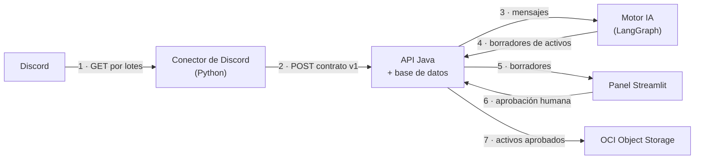
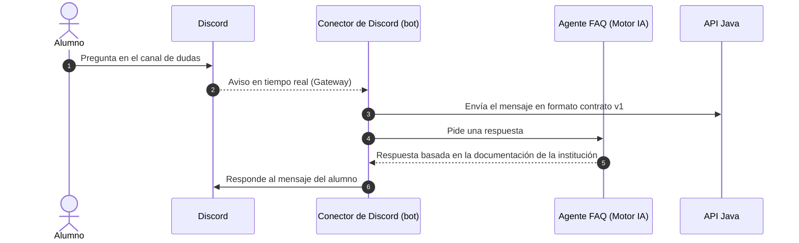

# Propuesta de arquitectura — InsightEdu Lab

> **Estado:** propuesta para discutir con el equipo · **Fecha:** 2026-09-29 · **Rama:** `feature/discord-ingestion`

## 0. Para qué sirve este documento

Este documento propone cómo se conectan las piezas del MVP. **No es una decisión tomada**: es un punto de partida para discutirlo en equipo.

Documentos relacionados:
- [EVENT_CATALOG.md](EVENT_CATALOG.md): qué pide el proyecto y qué eventos importan.
- [SCOPE.md](SCOPE.md): el alcance de la ingesta.

## 1. La idea central: un contrato, dos flujos

El sistema tiene **dos flujos** que comparten **un solo contrato**.

El contrato es el formato en que cada mensaje de Discord entra al sistema. Funciona como un enchufe común: cada equipo trabaja contra el contrato sin depender de cómo están hechas las otras piezas por dentro.

| Flujo | Para qué | Cada cuánto | Activos que alimenta |
|---|---|---|---|
| **A · Análisis** | Mirar hacia atrás: semanas de conversación | Por lotes (por ejemplo, cada hora o cada día) | LinkedIn, casos de éxito, FAQ y dashboard |
| **B · Bot en vivo** | Responder la duda que acaba de llegar | En segundos | Bot de dudas |

## 2. Flujo A · Análisis por lotes

1. El conector pide a Discord los mensajes nuevos.
2. Los transforma al contrato y los envía a la API Java, que los guarda.
3. El motor IA lee los mensajes, los clasifica (sentimiento, tema, tipo de evento) y
4. genera borradores de activos: posts, casos de éxito y FAQ.
5. El panel muestra los borradores y el dashboard.
6. Marketing o el CM aprueba o edita cada borrador.
7. Los activos aprobados se guardan en OCI, como exige el brief.

## 3. Flujo B · Bot en vivo

El bot envía el mensaje a la API **con el mismo contrato del flujo A**. Así, las dudas respondidas en vivo también entran al análisis.

## 4. Las piezas

| Pieza | Qué hace | Tecnología | Equipo |
|---|---|---|---|
| **Conector de Discord** | Es lo único que habla con Discord: extrae (A), escucha en vivo y responde (B) | Python: `httpx` y `discord.py` | Ingesta |
| **Contrato v1** | El formato común de los dos flujos | `pydantic` y JSON Schema | Ingesta |
| **API Java + base de datos** | El registro oficial: mensajes, borradores y aprobaciones | Spring Boot y JPA | Backend |
| **Motor IA** | Clasifica, genera los activos y responde con RAG | Python y LangGraph | IA |
| **Panel** | La aprobación humana y el dashboard de salud | Streamlit | Frontend o data |
| **OCI Object Storage** | Guarda los activos aprobados | OCI Always Free | Por definir (§7) |

## 5. Dónde se guardan los datos

Son tres niveles, y solo el tercero es obligatorio en la nube:

| Nivel | Qué es | Ejemplo | Dónde |
|---|---|---|---|
| Original | Lo que entrega Discord, sin tocar | El JSON crudo de cada mensaje | `data/raw/` (y, opcionalmente, un respaldo en OCI) |
| Contrato | Los mismos mensajes en el formato común | Autor, texto, fecha, canal… | La base de datos de Java |
| Activos | Lo que produce la IA y aprueba una persona | Un post de LinkedIn | OCI Object Storage |

En ingeniería de datos a estos niveles se los llama *bronze*, *silver* y *gold*. No hace falta ninguna herramienta especial para implementarlos.

## 6. Plan B

Si la API Java se atrasa, el conector puede escribir el contrato en archivos JSON, en local o en el bucket de OCI, y la IA leerlos de ahí. **El contrato no cambia.** Por eso definirlo primero reduce el riesgo del proyecto.

## 7. Preguntas para decidir en equipo

| # | Pregunta | Propuesta |
|---|---|---|
| 1 | ¿El bot pide la respuesta directamente al agente FAQ o pasa por la API Java? | **Directo.** Es más rápido y tiene menos puntos de falla. Java igual recibe el mensaje |
| 2 | ¿La base de datos oficial es la de Java? | Sí; las entidades JPA de backend apuntan a eso |
| 3 | ¿Cada cuánto corre el flujo A? | Cada hora para la demo; en producción, según el volumen |
| 4 | ¿Quién construye el bot en vivo? | La ingesta, porque ya conoce Discord, en una rama propia después del contrato |
| 5 | ¿Quién escribe los activos en OCI: Java o el motor IA? | Por definir |
