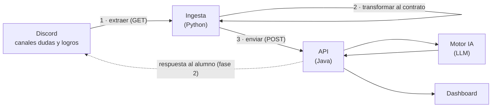
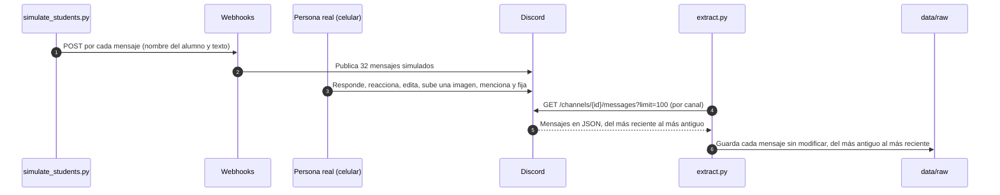

# Guía de datos de Discord — InsightEdu Lab

> **Versión:** 1.0 · **Fecha:** 2026-09-28 · **Rama:** `feature/discord-ingestion` · **Muestra analizada:** 38 mensajes (32 simulados y 6 de un usuario real)

## 0. Sobre este documento

**Objetivo.** Explicar, sin suponer experiencia previa:
- cómo son los mensajes que entrega Discord y cómo los obtuvimos;
- en qué se diferencian la documentación oficial, la simulación y un usuario real;
- qué hay que cuidar para que el proyecto funcione con alumnos reales.

**Para quién.** Todo el equipo de InsightEdu Lab (backend, data, frontend e IA) y cualquier persona que se sume después. No hace falta haber trabajado antes con Discord.

**Cómo leerlo.** La Parte A se lee de corrido, en unos 10 minutos. La Parte B es de consulta. La Parte C resume lo que sigue.

| Rol | Qué leer |
|---|---|
| Todos | Parte A (secciones 1 a 5) |
| Backend | Además: 6 (límites), la Parte B completa y 12 (contrato) |
| Data e IA | Además: 8 (campos del mensaje) y la Parte C |
| Frontend | Las secciones 4 y 5 con atención: qué mostrar (nombres, fechas en hora local, imágenes) |

**De dónde sale cada afirmación.** Las afirmaciones importantes llevan su fuente:
- 📘 **Documentación oficial** de la API de Discord (v10).
- 🧪 **Simulado:** observado en los mensajes publicados con webhooks.
- 👤 **Usuario real:** observado en los mensajes que una persona escribió con su propia cuenta.

**Documentos relacionados:**
- [SCOPE.md](../../../docs/historico/ingesta/SCOPE.md): alcance de la ingesta.
- [README](../README.md): cómo instalar y correr los scripts.

---

# Parte A · Entender

## 1. Contexto

> Qué hace InsightEdu, qué es la ingesta y por qué este documento importa.

InsightEdu Lab analiza las conversaciones de comunidades educativas para dos cosas: **responder automáticamente las dudas** de los alumnos y **detectar sus logros** (casos de éxito). La comunidad del proyecto vive en Discord, en dos canales: `#dudas` y `#logros`.

La **ingesta** es la puerta de entrada al sistema. Saca los mensajes de Discord y los entrega al resto en un formato acordado, el **contrato**. Todo lo que viene después depende de ella: si la ingesta entiende mal los datos, el backend, la IA y el dashboard heredan el error.



Este documento cubre el paso 1 (qué entrega Discord) y prepara el paso 2 (el contrato).

Hoy todo es **simulado**: todavía no hay alumnos reales. Por eso es clave saber en qué se parece la simulación a la realidad y en qué no.

## 2. Discord en 5 minutos

> Los términos que aparecen en el resto del documento.

**Como usuario de Discord**

| Término | Qué es | Ejemplo en InsightEdu |
|---|---|---|
| Servidor | El espacio de una comunidad | `InsightEdu Lab - Pruebas` |
| Canal | Una sala de conversación dentro del servidor | `#dudas`, `#logros` |
| Mensaje | Lo que alguien publica en un canal: texto, imágenes o ambos | "como instalo pyhton en windows??" |
| Respuesta | Un mensaje que cita a otro (opción "Responder") | Contestarle a Ana su pregunta |
| Reacción | Un emoji que se pone *sobre* un mensaje, sin escribir uno nuevo | 🎉 en "me contrataron" |
| Mención | Llamar a alguien con `@` para que reciba un aviso | `@Ana` |
| Rol | Una etiqueta que agrupa personas y define sus permisos. Cada bot tiene un rol con su mismo nombre | El rol `InsightEdu Ingesta` |
| Fijar | Destacar un mensaje en el canal | Fijar una respuesta oficial |
| Hilo | Una subconversación que nace de un mensaje | (todavía no se usa) |

**Como desarrollador**

| Término | Qué es | En InsightEdu |
|---|---|---|
| API | La "carta de pedidos" que acepta un servidor | La API REST de Discord |
| GET | Un pedido para **leer** datos | Pedir los mensajes de `#dudas` |
| POST | Un pedido para **enviar** datos | Publicar un mensaje simulado |
| JSON | Un formato de texto con pares `"campo": valor` | Cada mensaje llega como JSON |
| Campo | Cada dato dentro del JSON | `content` (el texto), `timestamp` (la fecha) |
| `null` | "Sin valor" | `edited_timestamp: null` significa que nunca se editó |
| ID (snowflake) | El código único que Discord le da a todo: mensajes, canales, personas. Llega como texto | `"1554205163710062683"` |
| Bot | Un programa con cuenta propia en Discord. Lee y escribe usando un *token*, que funciona como su contraseña | `InsightEdu Ingesta` |
| Webhook | Una URL secreta que publica mensajes en un canal. Solo escribe, y permite elegir el nombre del autor en cada mensaje | `Simulador alumnos` |
| UTC | La hora universal. Discord entrega todas las fechas en UTC | El `+00:00` al final de cada fecha |

## 3. Cómo obtuvimos los datos

> Qué se simuló, cómo y por qué. Sirve para juzgar qué tan representativa es la muestra.

**Por qué simular con webhooks.** No hay alumnos reales. Crear cuentas falsas y automatizarlas viola los términos de Discord; un webhook, en cambio, permite publicar con un nombre distinto en cada mensaje. Con un webhook por canal simulamos a 7 alumnos y 1 mentor.

**Qué incluimos a propósito.** Las conversaciones de `simulation/conversations.json` imitan datos sucios reales:
- errores de ortografía y jerga ("pyhton", "xq", "che");
- una pregunta partida en tres mensajes;
- bloques de código y enlaces;
- preguntas repetidas con otras palabras;
- una duda mezclada con un logro, una zona horaria ambigua y un mensaje en el canal equivocado;
- una historia de frustración que termina en logro.

**El proceso**



**Pruebas con un usuario real.** Para observar lo que la simulación no puede producir, una persona del equipo usó su propia cuenta:

| Prueba pedida | Lo que se hizo | Lo que se observó |
|---|---|---|
| Responder a "alguien? 😅" | Respondió y después editó la respuesta | 👤 Mensaje de `type` 19 que referencia al original; `edited_timestamp` con fecha |
| Reaccionar 🎉 a "me contrataron" | Igual a lo pedido | 👤 La reacción queda **dentro** del mensaje de Camila, no como un mensaje nuevo |
| Editar un mensaje | Editó dos | 👤 `edited_timestamp` deja de ser `null` |
| Enviar una captura | Envió una imagen y **después**, en otro mensaje, su descripción | 👤 Un mensaje con `content` vacío y un adjunto; la explicación llega en el mensaje siguiente |
| Mencionar al bot | Escribió `@` y eligió la sugerencia de Discord | 👤 Quedó mencionado el **rol** del bot (`<@&…>`), no el bot. Discord sugiere los dos con el mismo nombre |
| Fijar un mensaje | Fijó la imagen | 👤 La imagen queda con `pinned: true` y Discord crea un **aviso del sistema** (`type` 6) sin texto |

**Resultado:** 38 mensajes, 26 en `#dudas` y 12 en `#logros`. De ellos, 32 son simulados 🧪 y 6 reales 👤.

**Límites de la muestra.** Es pequeña, de un solo día y con una sola persona real. Sirve para conocer **la estructura** de los datos, no para medir comportamientos como frecuencias u horarios.

## 4. Tres fuentes, tres realidades

> La diferencia más importante del documento: lo que dice la documentación, lo que produce la simulación y lo que produce una persona real no siempre coinciden.

### Comparación rápida

| Aspecto | 📘 Documentación | 🧪 Simulado (webhook) | 👤 Usuario real |
|---|---|---|---|
| Quién es el autor (`author.id`) | El autor "no está garantizado que sea un usuario válido": si el mensaje lo generó un webhook, corresponde al ID, nombre y avatar del webhook | El ID **del webhook**: igual para todos los alumnos de un canal y distinto entre canales | El ID propio de la persona, que no cambia |
| Nombre | `username` "no es único en la plataforma"; `global_name` es el nombre visible | `username` es el nombre que puso el script; `global_name` es `null` | `username` (su usuario) y `global_name` (su nombre visible) |
| Marca de origen | `webhook_id` aparece si el mensaje lo generó un webhook | Tiene `webhook_id` y `author.bot: true` | No tiene `webhook_id` y el campo `author.bot` no viene |
| Respuestas | `type` 19, con `message_reference` y `referenced_message` | Imposibles: los 32 son `type` 0 | Funcionan |
| Reacciones | `reactions` es opcional | Solo si una persona reacciona | Funcionan |
| Menciones | `mentions` para usuarios y `mention_roles` para roles | "@Ana" queda como texto plano | Aparece `<@&id>` si se elige el rol |
| Fechas | ISO 8601 | Todas dentro del mismo minuto | Repartidas en el tiempo |
| Mensajes sin texto | `content` llega vacío si el bot no tiene el permiso de contenido; también puede haber mensajes solo con adjuntos | No hay | Una imagen sola y un aviso de fijado |
| Campos del perfil | Una lista documentada de campos del usuario | Pocos campos | Campos extra; 4 de ellos **no están documentados** |

### Ejemplos crudos, lado a lado

Los comentarios `// ←` no son parte del JSON: los agregamos para explicar. Los datos de la persona real están ocultos.

**A · 🧪 Mensaje simulado** (webhook, `#dudas`)
```jsonc
{
  "type": 0,                                    // ← mensaje normal
  "content": "hola buenas noches",              // ← primera parte de una pregunta partida en 3 mensajes
  "mentions": [],
  "mention_roles": [],
  "attachments": [],
  "embeds": [],
  "timestamp": "2026-09-28T18:56:26.764000+00:00",  // ← UTC. Los 32 simulados caen en el mismo minuto
  "edited_timestamp": null,
  "flags": 0,
  "components": [],
  "id": "1554205163710062683",
  "channel_id": "1554158212742127821",
  "author": {
    "id": "1554160711800717417",                // ← es el ID del webhook, NO el de "Ana"
    "username": "Ana Pérez",                    // ← el nombre lo eligió el script
    "avatar": null,
    "discriminator": "0000",                    // ← "0000" delata un webhook
    "public_flags": 0,
    "flags": 0,
    "bot": true,                                // ← los webhooks cuentan como bot
    "global_name": null,
    "clan": null,
    "primary_guild": null
  },
  "pinned": false,
  "mention_everyone": false,
  "tts": false,
  "webhook_id": "1554160711800717417"           // ← igual a author.id: así se reconoce lo simulado
}
```

**B · 👤 Respuesta de un usuario real** (`type` 19)
```jsonc
{
  "type": 19,                                   // ← REPLY: responde a otro mensaje
  "content": "Que necesitas @Ana Pérez ?",      // ← "@Ana Pérez" es texto: a un webhook no se lo puede mencionar
  "mentions": [],                               // ← por eso está vacío
  "mention_roles": [],
  "attachments": [],
  "embeds": [],
  "timestamp": "2026-09-28T21:24:55.925000+00:00",
  "edited_timestamp": "2026-09-28T21:25:19.495000+00:00",  // ← se editó 24 s después; la API solo entrega la versión final
  "flags": 0,
  "components": [],
  "id": "1554242531439415440",
  "channel_id": "1554158212742127821",
  "author": {
    "id": "<oculto>",                           // ← ID propio de la persona
    "username": "<oculto>",
    "avatar": null,
    "discriminator": "0",                       // ← "0" en cuentas reales actuales
    "public_flags": 0,
    "flags": 0,
    "banner": null,
    "accent_color": null,
    "global_name": "<oculto>",                  // ← nombre visible
    "avatar_decoration_data": null,
    "collectibles": null,
    "display_name_styles": null,                // ← no documentado
    "vad_colors": null,                         // ← no documentado
    "banner_color": null,                       // ← no documentado
    "clan": null,                               // ← no documentado
    "primary_guild": null
  },                                            // ← no hay campo "bot": que falte equivale a false
  "pinned": false,
  "mention_everyone": false,
  "tts": false,
  "message_reference": {                        // ← a qué mensaje responde
    "type": 0,
    "channel_id": "1554158212742127821",
    "message_id": "1554205273621667853",        // ← el "alguien? 😅" de Ana
    "guild_id": "1554157903701741700"
  },
  "referenced_message": { "id": "1554205273621667853", "content": "alguien? 😅", "…": "copia completa del mensaje original" }
}
```

**C · 👤 Imagen sin texto, fijada**
```jsonc
{
  "type": 0,
  "content": "",                                // ← vacío: la descripción llegó en el mensaje siguiente
  "attachments": [{
    "id": "1554243551888416798",
    "filename": "captura.jpg",
    "size": 97526,
    "content_type": "image/jpeg",
    "url": "https://cdn.discordapp.com/attachments/…/captura.jpg?ex=6abc2d9b&is=…&hm=…"  // ← caduca en 24 h (ver §11)
  }],
  "timestamp": "2026-09-28T21:28:59.297000+00:00",
  "id": "1554243552215703622",
  "author": { "…": "igual que en B" },
  "pinned": true                                // ← la persona la fijó
}
```

**D · 👤 Aviso del sistema** (`type` 6, "X fijó un mensaje")
```jsonc
{
  "type": 6,                                    // ← CHANNEL_PINNED_MESSAGE: lo genera Discord, no es una duda ni un logro
  "content": "",                                // ← sin texto
  "timestamp": "2026-09-28T21:30:56.858000+00:00",
  "id": "1554244045302399059",
  "author": { "…": "quien fijó el mensaje" },   // ← el autor es quien fijó, no quien escribió
  "message_reference": {                        // ← apunta al mensaje fijado (el C)
    "type": 0,
    "channel_id": "1554158212742127821",
    "message_id": "1554243552215703622"
  }
}
```

### Qué tener presente

- **En la simulación, `author.id` no identifica a nadie.** Es el ID del webhook: la misma "Ana Pérez" tiene un ID en `#dudas` y otro en `#logros`, y en un mismo canal todos los alumnos comparten el mismo.
- **Un campo puede faltar, no solo estar vacío.** Por ejemplo, `reactions`, `message_reference`, `referenced_message`, `webhook_id` y `author.bot`.
- **No todo mensaje es de un alumno ni tiene texto.** Hay avisos del sistema e imágenes solas.
- **La simulación no produce** respuestas, menciones reales, ediciones, adjuntos ni avisos del sistema. Esos casos solo los conocemos por las pruebas con un usuario real y por la documentación.

## 5. Qué cambia con alumnos reales

> Los riesgos que la simulación no muestra, o muestra a medias, y cómo evitar que afecten al proyecto.

| # | Riesgo | Fuente | Qué pasaría | Qué hacer | Quién |
|---|---|---|---|---|---|
| 1 | Identificar alumnos por su nombre | 📘 🧪 | Los nombres se repiten y cambian: dos alumnos quedarían mezclados | Identificar por `author.id` si es real, y por `author.username` solo en la simulación | Ingesta, backend |
| 2 | Una idea en varios mensajes | 🧪 👤 | La IA responde a fragmentos ("hola", "tengo una duda") o a una imagen sin su explicación | Mantener 1 mensaje = 1 registro y agrupar en un paso aparte (ver §14) | Ingesta o IA |
| 3 | Mensajes sin texto | 👤 | La IA recibe texto vacío y el dashboard muestra filas vacías | Marcar si el mensaje tiene texto o adjuntos | Ingesta |
| 4 | Avisos del sistema mezclados | 📘 👤 | Se cuentan como mensajes de alumnos y las métricas se inflan | Clasificar por `type`: solo `0` y `19` son mensajes de personas | Ingesta |
| 5 | Mencionar el rol en vez del bot | 👤 | En la fase 2, el bot no se entera de que lo llamaron | Reconocer las dos formas: `<@id>` y `<@&id>` | Fase 2 |
| 6 | Las URLs de los adjuntos caducan | 👤 | Imágenes rotas en el dashboard al día siguiente | Guardar los metadatos. Si hace falta la imagen, descargarla antes de que venza o volver a pedir el mensaje | Ingesta, frontend |
| 7 | Campos que a veces faltan | 🧪 👤 | Falla el código que espera siempre la misma estructura | El contrato entrega siempre todos sus campos, con valores explícitos (`[]`, `null`, `false`) | Ingesta, backend |
| 8 | Discord agrega campos sin avisar | 👤 | Se rompe lo que valide el JSON "completo" de Discord | Tomar solo los campos necesarios e ignorar el resto | Ingesta, backend |
| 9 | Sin permiso de lectura, la lista llega vacía | 📘 | Parece que "no hay mensajes" y se pierden datos sin ningún error | `verify_connection.py` advierte cuando un canal devuelve 0 mensajes | Ingesta |
| 10 | Fechas en UTC | 📘 | Horas mal mostradas: Argentina es UTC−3 y México UTC−6 | Guardar en UTC y convertir solo al mostrar. En Java, `OffsetDateTime` o `Instant`, no `LocalDateTime` (P4) | Backend, frontend |
| 11 | Ediciones y borrados | 📘 | Lo guardado queda desactualizado: la API solo da la versión final y los mensajes borrados desaparecen | Definir una política cuando exista la escucha en tiempo real | Pendiente |
| 12 | Volumen y límites de la API | 📘 | Extracción lenta o bloqueo temporal (ver §6) | Paginar y respetar los límites (ya implementado). Extraer solo lo nuevo (P6) | Ingesta |
| 13 | Mensajes en el canal equivocado | 🧪 | Un logro publicado en `#dudas`, o una duda en `#logros` | No confiar solo en el canal: que la IA clasifique el contenido | IA |
| 14 | Datos personales | 👤 | Problemas de privacidad | `data/` no se sube al repo. Decidir si se anonimiza (P3) | Equipo |

## 6. Límites de la API de Discord

> Lo que Discord impone según su documentación oficial 📘, y cómo lo manejamos.

| Límite | Valor | Qué significa para nosotros |
|---|---|---|
| Mensajes por petición | De 1 a 100 (50 por defecto), del más reciente al más antiguo | Hay que paginar; `extract.py` ya lo hace |
| `before` / `after` / `around` | Solo uno por petición | Define cómo se hará la extracción incremental (P6) |
| Permisos | Hace falta `VIEW_CHANNEL`. Sin `READ_MESSAGE_HISTORY`, Discord devuelve **una lista vacía, sin error** | Es un riesgo silencioso (ver §5, riesgo 9) |
| Límite global | 50 peticiones por segundo por bot | Muy por encima de nuestro uso |
| Límite por ruta | Se informa en las cabeceras `X-RateLimit-*`. Si se excede, responde 429 con `retry_after` (segundos de espera) | `discord_api.py` espera y reintenta |
| Peticiones inválidas | 10.000 cada 10 minutos (respuestas 401, 403 y 429) provocan un **bloqueo temporal de la IP** | En una red compartida, como la de una empresa, afectaría a todos los que salen por esa IP |
| Permiso de contenido (Message Content Intent) | Sin él, `content`, `embeds`, `attachments` y `components` llegan vacíos | Ya está activado en nuestro bot |

---

# Parte B · Referencia

## 7. El lote

> Cada archivo de `data/raw/` corresponde a un canal. `extract.py` envuelve los mensajes con estos datos del lote, sin tocar los mensajes.

| Campo | Tipo | Ejemplo | Descripción |
|---|---|---|---|
| `canal` | texto | `"dudas"` | Nombre del canal extraído |
| `canal_id` | texto | `"1554158212742127821"` | ID del canal en Discord |
| `extraido_en` | fecha ISO 8601 UTC | `"2026-09-28T21:33:12.422595+00:00"` | Momento de la extracción |
| `total` | entero | `26` | Cantidad de mensajes |
| `mensajes` | lista | — | Mensajes tal como los entregó Discord, del más antiguo al más reciente |

## 8. Campos del mensaje

> Todos los campos que trae un mensaje. Sirve para saber qué se puede usar y qué hay que cuidar.

**Cómo leer la tabla:**
- **Siempre:** el campo viene en todos los mensajes, aunque sea vacío (`""`, `[]` o `null`).
- **A veces:** el campo **no existe** en el JSON cuando no aplica.
- **Uso:**
  - **FAQ:** sirve para responder dudas.
  - **Logros:** sirve para detectar hitos.
  - **Técnico:** hace falta para que el sistema funcione.
  - **—:** no se usa.

| Campo | Tipo | ¿Viene? | Ejemplo | Uso | Nota |
|---|---|---|---|---|---|
| `id` | texto (snowflake) | Siempre | `"1554205163710062683"` | Técnico | Único. Crece con el tiempo, así que ordenar por `id` es ordenar por fecha. Viene como texto, no como número |
| `channel_id` | texto | Siempre | `"1554158212742127821"` | Técnico, Logros | Indica si el mensaje es de `#dudas` o de `#logros`. Hace falta para responder en el lugar correcto |
| `type` | entero | Siempre | `0` | Técnico | Ver §10. Solo `0` y `19` son mensajes escritos por personas |
| `content` | texto | Siempre | `"como instalo pyhton en windows??…"` | FAQ, Logros | 👤 Puede venir **vacío**: imagen sola o aviso del sistema. Trae códigos (`<@&id>`), markdown y bloques de código tal cual |
| `timestamp` | fecha ISO 8601 | Siempre | `"2026-09-28T18:56:26.764000+00:00"` | FAQ, Logros | Siempre en UTC (`+00:00`) y con microsegundos |
| `edited_timestamp` | fecha o `null` | Siempre | `null` | Técnico | Si no es `null`, el mensaje se editó. 📘 La API solo entrega la versión final del texto |
| `author` | objeto | Siempre | ver §9 | FAQ, Logros | Quién escribió el mensaje |
| `webhook_id` | texto | A veces | `"1554160711800717417"` | Técnico | Solo en los mensajes de webhook, es decir, en los simulados 🧪 |
| `attachments` | lista | Siempre | ver §11 | FAQ | Archivos adjuntos, por ejemplo la captura de un error |
| `embeds` | lista | Siempre | `[]` | — | Vistas previas de enlaces. 🧪 En esta muestra, los mensajes con enlaces no generaron ninguna: no conviene depender de ellas |
| `reactions` | lista | A veces | 🎉 ×1 | Logros | **Falta** cuando nadie reaccionó (no viene como `[]`). Da el conteo, no quién reaccionó |
| `mentions` | lista de usuarios | Siempre | `[]` | Técnico | Usuarios mencionados con `<@id>` |
| `mention_roles` | lista de IDs | Siempre | `["1554160419470315653"]` | — | Roles mencionados con `<@&id>` |
| `mention_everyone` | booleano | Siempre | `false` | — | Si el mensaje menciona a `@everyone` |
| `message_reference` | objeto | A veces | ver §11 | FAQ | En una respuesta (`type` 19), a qué mensaje responde. En `type` 6, qué mensaje se fijó |
| `referenced_message` | mensaje completo | A veces | — | FAQ | 📘 Copia completa del mensaje respondido; solo viene en `type` 19 (y en 21 y 23). Duplica datos: al contrato le basta con el ID |
| `pinned` | booleano | Siempre | `true` | FAQ (posible) | Mensaje fijado. Suele marcar contenido importante, como una respuesta oficial |
| `flags` | entero | Siempre | `0` | — | Opciones internas de Discord |
| `components` | lista | Siempre | `[]` | — | Botones y menús de bots |
| `tts` | booleano | Siempre | `false` | — | Si el mensaje se lee en voz alta |

## 9. El autor (`author`)

> Qué datos del autor llegan según el origen del mensaje. Es la base para identificar a cada alumno.

| Campo | 🧪 Webhook (simulado) | 👤 Usuario real | Uso |
|---|---|---|---|
| `id` | Igual a `webhook_id`: **uno por webhook**, es decir, uno para `#dudas` y otro para `#logros` | Único por persona, no cambia nunca | Identificar al alumno (solo si es real) |
| `username` | El nombre que puso el script (`"Ana Pérez"`) | Su usuario de Discord (p. ej. `ana.perez_23`) | En la simulación es la única identidad disponible |
| `global_name` | `null` | El nombre visible | Nombre para mostrar |
| `discriminator` | `"0000"` | `"0"` | — |
| `bot` | `true` | **No viene** (que falte equivale a `false`) | Filtrar bots reales |
| `avatar` | `null` | Un código (hash) o `null` | — |
| `public_flags`, `flags`, `primary_guild` | Vienen | Vienen | — |
| `clan` | Viene (`null`) | Viene | — ⚠️ No documentado |
| `banner`, `accent_color`, `avatar_decoration_data`, `collectibles` | No vienen | Vienen | — (estética del perfil) |
| `banner_color`, `display_name_styles`, `vad_colors` | No vienen | Vienen | — ⚠️ No documentados |

📘 La documentación lista otros campos del usuario (`email`, `locale`, `verified`, etc.) que no aparecieron en ningún mensaje de la muestra.

## 10. Tipos de mensaje (`type`)

> El campo `type` dice si un mensaje lo escribió una persona o lo generó Discord.

| `type` | Nombre oficial | Qué es | En la muestra | ¿Lo escribió un alumno? |
|---|---|---|---|---|
| `0` | DEFAULT | Mensaje normal | 36 | Sí |
| `19` | REPLY | Respuesta a otro mensaje | 1 | Sí |
| `6` | CHANNEL_PINNED_MESSAGE | Aviso de "X fijó un mensaje" | 1 | No. `content` viene vacío y el autor es quien fijó |

📘 Hay otros tipos documentados que no aparecieron en la muestra: `7` USER_JOIN ("X se unió"), `18` THREAD_CREATED y `21` THREAD_STARTER_MESSAGE.

## 11. Estructuras dentro del mensaje

> El detalle de los objetos que van dentro de un mensaje.

**Adjunto (`attachments[]`)**
```json
{
  "id": "1554243551888416798",
  "filename": "captura.jpg",
  "size": 97526,
  "url": "https://cdn.discordapp.com/attachments/…/captura.jpg?ex=6abc2d9b&is=…&hm=…",
  "proxy_url": "https://media.discordapp.net/attachments/…",
  "width": 831,
  "height": 1080,
  "content_type": "image/jpeg",
  "content_scan_version": 4,
  "placeholder": "…",
  "placeholder_version": 1
}
```
⚠️ **La URL caduca.** El parámetro `ex` es la fecha de vencimiento, escrita en hexadecimal como tiempo Unix. En la muestra, `ex=6abc2d9b` equivale a 2026-09-29 21:28:59 UTC: **24 horas exactas** después de subir el archivo 👤.

**Reacción (`reactions[]`)**
```json
{ "emoji": { "id": null, "name": "🎉" }, "count": 1, "count_details": { "burst": 0, "normal": 1 },
  "burst_colors": [], "me_burst": false, "burst_me": false, "me": false, "burst_count": 0 }
```
- `emoji.id` en `null` indica un emoji estándar; si trae un ID, es un emoji personalizado del servidor.
- `me` indica si el propio bot reaccionó.
- Para saber *quién* reaccionó hace falta otra petición: `GET /channels/{id}/messages/{id}/reactions/{emoji}`.

**Referencia (`message_reference`)**
```json
{ "type": 0, "channel_id": "1554158212742127821", "message_id": "1554205273621667853", "guild_id": "1554157903701741700" }
```
En los avisos de fijado (`type` 6) no viene `guild_id` 👤.

---

# Parte C · Qué sigue

## 12. Qué implica para el contrato (O4)

> Cómo se traducen los hallazgos en el diseño del contrato que recibirá la API Java.

- **Solo los campos necesarios.** Se toman los campos que hacen falta y se ignoran los desconocidos. Así, un campo nuevo de Discord no rompe nada.
- **Siempre los mismos campos.** Los campos ausentes se reemplazan por valores explícitos: reacciones → `[]`, `responde_a` → `null`, `es_simulado` → `true`/`false`.
- **Identidad del autor:**
  - si es real, `author.id`;
  - si es simulado, `author.username`, porque su `author.id` es el del webhook.
- **Origen del mensaje:** alumno, sistema (`type` 6, 7…), bot o simulado.
- **Respuestas:** se guarda `responde_a` (`message_reference.message_id`) y no se copia `referenced_message`.
- **Mensajes sin texto:** se marcan, y los adjuntos se guardan como metadatos (tipo, nombre y tamaño), sin la URL.
- **Texto original:** se conserva tal cual, incluidos los códigos. La limpieza queda para el pendiente P1.
- **Ediciones:** `editado` (sí/no) y `editado_en`.
- **1 mensaje de Discord = 1 registro.** Sin agrupar; la agrupación es un paso aparte (§14).

## 13. Lo que la muestra todavía no cubre

> Casos que existen en Discord pero que no observamos. Conviene probarlos antes de ir a producción.

- La mención a un usuario (`<@id>`); en la prueba quedó mencionado el rol.
- Los avisos de "X se unió" (`type` 7), los hilos (pendiente P5), los stickers y los emojis personalizados (`<:nombre:id>`).
- Los mensajes borrados. La API no los devuelve: simplemente dejan de estar en el historial.
- Las vistas previas de enlaces (`embeds`).
- Varias personas reales conversando entre sí.

## 14. Decisiones abiertas

> Temas que este documento plantea pero no resuelve. Hay que decidirlos en equipo.

| Decisión | Opciones | Punto de partida | Quién decide |
|---|---|---|---|
| Agrupar mensajes partidos | a) La ingesta agrupa. b) El motor IA agrupa al leer | La ingesta entrega 1 a 1, con los datos que permiten agrupar (autor, canal, fecha, `responde_a`); la agrupación queda en un paso posterior | Ingesta e IA |
| Quién publica las respuestas en Discord (fase 2) | a) El bot en Python. b) La API Java | Por definir | Equipo |
| Anonimizar a los alumnos (P3) | a) Guardar los IDs reales. b) Reemplazarlos por un seudónimo estable | Por definir | Equipo |
| Extraer los hilos (P5) | a) Sí. b) No, por ahora | Por definir | Ingesta |
| Qué hacer con ediciones y borrados | a) Guardar solo la última versión. b) Guardar el historial | Por definir | Equipo |
